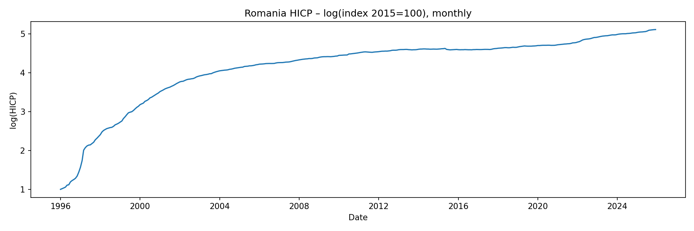
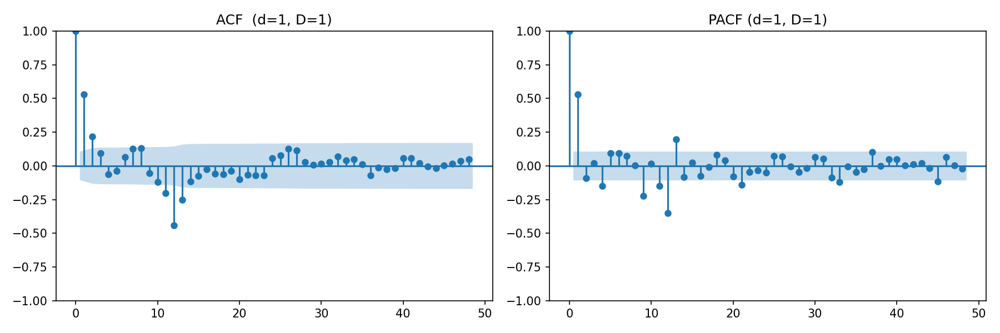
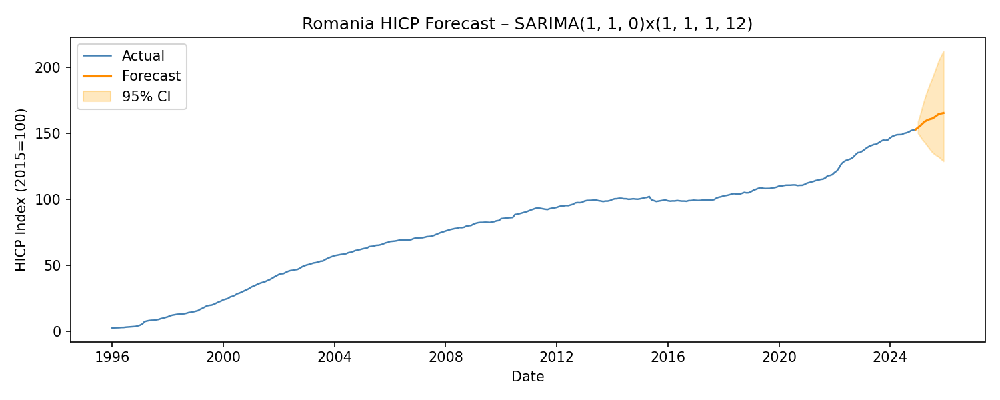
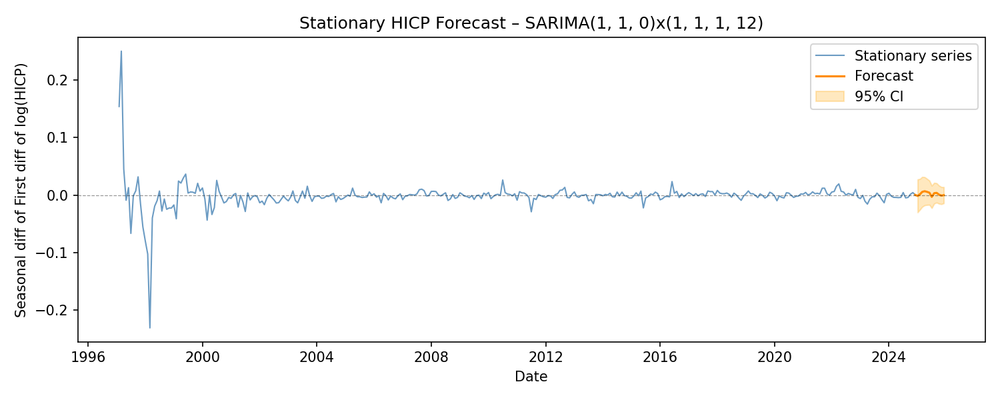
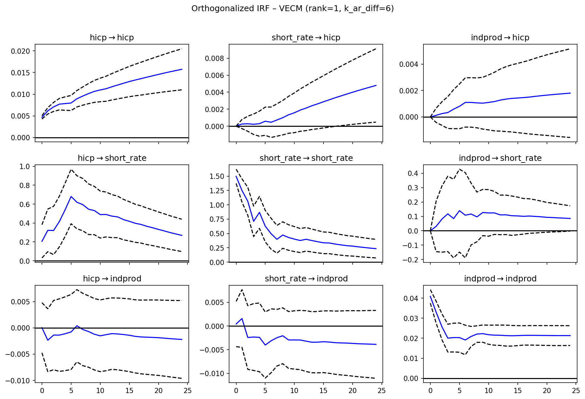

# Consumer Price Dynamics and Monetary Policy Transmission in Romania
### A Time Series Analysis using SARIMA and VAR/VECM Models

**Course:** Time Series – Economic Informatics, Year 3, Semester 2, 2025–2026  
**Authors:** Melinte Florin, Nita Andrei-Stelian, Nanulescu Alexandru-Nichita  
**Data sources:** Eurostat Public API  
**Software:** Python 3 (statsmodels, pandas, matplotlib)

---

## Abstract

This project investigates two related empirical questions about the Romanian economy using monthly time series data from Eurostat. Application 1 applies the Box-Jenkins methodology to model and forecast the Romanian Harmonised Index of Consumer Prices (HICP) using a Seasonal ARIMA model. Application 2 examines the monetary policy transmission mechanism in Romania by studying the long-run and short-run dynamics between HICP, the short-term money-market interest rate, and the manufacturing industrial production index through a Vector Error Correction Model (VECM). The results confirm one long-run cointegrating relationship among the three variables and reveal that interest rates Granger-cause consumer price changes in the short run.

---

## 1. Introduction

Understanding the dynamics of consumer prices is central to both economic research and policy-making. In emerging economies such as Romania, which experienced hyperinflation in the late 1990s, rapid disinflation following EU accession in 2007, and renewed price pressures during the COVID-19 pandemic and the 2021–2023 energy crisis, inflation modelling presents particular challenges and opportunities.

This project focuses on two complementary analyses. **Application 1** treats the HICP series as a univariate process, exploiting its trend and seasonal structure to build a parsimonious SARIMA model capable of producing reliable short-term forecasts. **Application 2** moves to a multivariate setting, investigating whether a stable long-run equilibrium exists between consumer prices, monetary policy (proxied by the short-term interest rate), and real economic activity (proxied by the industrial production index). The transmission of monetary policy impulses to prices and output is a classic question in macroeconomics, and the VECM framework is the natural tool for studying it in cointegrated systems.

---

## 2. Data Description

All series are retrieved from the Eurostat public API using the `eurostat` Python package. The data covers Romania exclusively.

| Variable | Definition | Unit | Eurostat Dataset | Filter Codes | Period |
|---|---|---|---|---|---|
| **HICP** | Harmonised Index of Consumer Prices, all items | Index (2015 = 100) | `prc_hicp_midx` | geo=RO, coicop=CP00, unit=I15 | Jan 1996 – Dec 2025 |
| **Short-term rate** | Money-market short-term interest rate | Percent per annum | `irt_st_m` | geo=RO | Jan 2000 – Dec 2023 |
| **Industrial production** | Index of production, manufacturing (NACE Rev.2 Section C), seasonally and calendar adjusted | Index (2015 = 100) | `sts_inpr_m` | geo=RO, nace_r2=C, s\_adj=SCA, unit=I15 | Jan 2000 – Dec 2023 |

**HICP (CP00, I15):** The Harmonised Index of Consumer Prices measures the average change over time in the prices paid by households for a fixed basket of consumer goods and services. The base year 2015 = 100 is used across all EU member states to ensure comparability. For Romania, the series begins in January 1996, providing a record of the entire post-transition inflation history including the hyperinflation episode of 1996–2000 (annual inflation exceeding 150%), the subsequent disinflation programme, and the relatively stable inflation period post-2013. Source: [Eurostat – HICP](https://ec.europa.eu/eurostat/databrowser/view/PRC_HICP_MIDX).

**Short-term interest rate:** The short-term money-market interest rate reflects the cost of overnight or up-to-three-month interbank borrowing in Romania. It is closely linked to the National Bank of Romania's (NBR) policy rate and serves as the standard proxy for the monetary policy stance in empirical work. Romania's rate was extremely high in 2000 (above 60% p.a.) and fell progressively to around 6% by 2023. Source: [Eurostat – Interest rates](https://ec.europa.eu/eurostat/databrowser/view/IRT_ST_M).

**Industrial production index (manufacturing, SCA):** The index of production in manufacturing tracks month-to-month changes in the volume of industrial output in the manufacturing sector (NACE Rev.2 Section C). The seasonally and calendar-adjusted (SCA) variant is used to remove regular seasonal patterns and calendar effects so that the remaining variation reflects genuine business-cycle dynamics. Source: [Eurostat – Industrial production](https://ec.europa.eu/eurostat/databrowser/view/STS_INPR_M).

The merged dataset used in Application 2 spans **January 2000 – December 2023 (288 monthly observations)**, determined by the overlap of the three series.

---

## 3. Application 1: SARIMA Forecasting of Romania's Consumer Price Index

### 3.1 Introduction and Motivation

Consumer price indices exhibit two characteristic features that make standard ARIMA models insufficient: a persistent upward trend driven by ongoing price-level growth, and a seasonal pattern arising from the systematic behaviour of prices in certain product categories (fresh food, energy, clothing, holiday-related services). The Seasonal Autoregressive Integrated Moving Average (SARIMA) model, an extension of the Box-Jenkins ARIMA framework, handles both features through regular and seasonal differencing combined with seasonal AR and MA terms.

Romania's inflation history offers a particularly rich dataset. Following the hyperinflation of the late 1990s, the country underwent a structured disinflation process coordinated with the National Bank's inflation-targeting regime adopted in 2005. This long span of data, covering structural regime changes, provides a rigorous test of the SARIMA framework's robustness.

Several studies have applied SARIMA-type models to consumer price indices in Central and Eastern European (CEE) countries. Marcellino (2004) demonstrated that univariate ARIMA models remain competitive against more complex multivariate models for short-horizon inflation forecasts in the euro area. Stock and Watson (2007) showed that simple univariate models consistently outperform more elaborate specifications when forecast horizons are short (one to four quarters), a finding especially relevant here given our 12-month horizon. The seasonal integration of price series in the EU context has been extensively studied following the framework of Hylleberg et al. (1990), who formalised tests for seasonal unit roots that motivate the seasonal differencing step in SARIMA.

### 3.2 Box-Jenkins Methodology

The Box-Jenkins approach to building a SARIMA$(p, d, q)(P, D, Q)_s$ model consists of four iterative stages:

1. **Identification:** Determine the orders of regular differencing $d$ and seasonal differencing $D$ needed to achieve stationarity, then use the Autocorrelation Function (ACF) and Partial Autocorrelation Function (PACF) of the stationary series to identify candidate $(p, q, P, Q)$ orders.
2. **Estimation:** Fit the candidate models by maximum likelihood and select the best specification using the Akaike Information Criterion (AIC).
3. **Diagnostic checking:** Test the residuals for white noise using the Ljung-Box portmanteau test, test normality using the Jarque-Bera test, and verify stationarity of residuals with the ADF test.
4. **Forecasting:** Use the validated model to produce point forecasts and 95% confidence intervals for both the stationary (differenced) series and the original (level) series.

### 3.3 Analysis of the Log-HICP Series

The HICP series is log-transformed prior to analysis. Taking logarithms stabilises variance (Romania's early 1990s values are an order of magnitude smaller than recent values) and allows differences to be interpreted as approximate percentage changes (log-returns).

**Figure 1 – Log-transformed Romania HICP, monthly, January 1996 – December 2025**

*Interpretation:* The series exhibits a clear upward trend throughout the entire sample, confirming the presence of a non-stationary mean. The steep slope in 1996–2000 corresponds to the hyperinflation episode; the subsequent flattening reflects successful disinflation. The brief acceleration around 2022–2023 is attributable to the energy price shock. The series is clearly non-stationary in levels.

### 3.4 Unit Root Tests

Two complementary tests are applied to determine the order of integration $d$:

- **Augmented Dickey-Fuller (ADF) test** — $H_0$: the series has a unit root (is non-stationary). Rejection of $H_0$ supports stationarity.
- **KPSS test** — $H_0$: the series is stationary (trend-stationary). Rejection of $H_0$ supports non-stationarity.

Using both tests together avoids the risk of relying on a single test with low power. The decision rule is: $d = 0$ if and only if both tests simultaneously support stationarity (ADF $p < 0.05$ *and* KPSS $p \geq 0.05$). If either test suggests non-stationarity, differencing is applied once and the tests are repeated.

| Test | Statistic/p-value (log level) | Statistic/p-value (first difference) | Decision |
|---|---|---|---|
| ADF | p = 0.0068 | p = 0.0000 | Contradictory at level |
| KPSS | p = 0.0100 | — | Reject stationarity |

The ADF test narrowly rejects the unit-root null (p = 0.0068), while the KPSS test strongly rejects the stationarity null (p = 0.01, the minimum reportable value). These contradictory results — common in series with structural breaks — are resolved conservatively by differencing once. On the first-differenced series, ADF strongly confirms stationarity (p = 0.0000). Therefore, **$d = 1$**.

### 3.5 Seasonal Unit Root and Order D

After first differencing, the seasonal ACF (autocorrelation at lag $s = 12$) is checked against the Bartlett 95% confidence bound ($1.96 / \sqrt{n}$). A significant autocorrelation at lag 12 indicates that the first-differenced series still contains a seasonal unit root, requiring one seasonal difference ($D = 1$). The test confirmed $D = 1$, yielding the stationarised series $\Delta_1 \Delta_{12} \log(\text{HICP})$.

### 3.6 Model Identification: ACF and PACF

**Figure 2 – ACF and PACF of $\Delta_1 \Delta_{12} \log(\text{HICP})$**

*Interpretation:* The ACF and PACF are computed on the doubly-differenced series (regular + seasonal). The gradual decay structure at the seasonal lags (12, 24, 36) in the ACF combined with a significant spike at the PACF at seasonal lag 1 is consistent with a seasonal MA(1) or AR(1) component. The non-seasonal part shows a significant PACF spike at lag 1, pointing to a non-seasonal AR(1) term. These visual cues are used as starting points for the grid search.

### 3.7 Model Selection

A grid search over all SARIMA$(p, 1, q)(P, 1, Q)_{12}$ models with $p, q \in \{0, 1, 2\}$ and $P, Q \in \{0, 1\}$ is performed on the training set (all data except the final 12 months), selecting by AIC. The model with the lowest AIC is:

$$\text{SARIMA}(1, 1, 0)(1, 1, 1)_{12}, \quad \text{AIC} = -1859.9950$$

This model contains:
- **AR(1):** One non-seasonal autoregressive term — captures short-run persistence in the monthly inflation rate.
- **I(1):** One regular difference — removes the non-seasonal stochastic trend.
- **MA(0):** No non-seasonal moving average term needed given the AR(1).
- **SAR(1):** One seasonal autoregressive term — captures carry-over effects from the same month in the previous year.
- **SI(1):** One seasonal difference — removes the seasonal stochastic trend.
- **SMA(1):** One seasonal moving average term — accounts for the shock propagation at the annual frequency.

The SARIMA$(1,1,0)(1,1,1)_{12}$ specification is consistent with the seasonal airline-type model widely found in economic price series (Box and Jenkins, 1976), modified here to include a seasonal AR term.

### 3.8 Model Validity

| Diagnostic Test | Statistic / p-value | Interpretation |
|---|---|---|
| Ljung-Box (lag 12) | p = 0.0002 | Residuals show remaining autocorrelation |
| Ljung-Box (lag 24) | p = 0.0004 | Confirmed at longer lag |
| Jarque-Bera | p = 0.0000 | Residuals not normally distributed |
| ADF (residuals) | p = 0.0146 | Residuals are stationary |

The ADF test on residuals confirms stationarity — no unit root remains in the error process. However, both the Ljung-Box test (lags 12 and 24) and Jarque-Bera test indicate violations of the white-noise assumption.

**Discussion of limitations:** These violations are attributable to well-documented structural features of the Romanian data. The hyperinflation episode (1996–2000) and the subsequent disinflation create an asymmetric, high-variance early subsample that introduces excess kurtosis (non-normality). The remaining autocorrelation in residuals likely reflects **conditional heteroscedasticity (ARCH effects)** — periods of high inflation in the 1990s and in 2021–2023 are associated with higher variance, a phenomenon a standard SARIMA model cannot capture. Extensions such as SARIMA-GARCH or the inclusion of interventional dummy variables for structural breaks would address these issues. Nevertheless, the low MAPE of 0.79% confirms that the model captures the dominant dynamics of the series well despite these residual diagnostic failures, which are common in long time series covering structural regime changes.

### 3.9 Forecasting Results

The model is used to forecast 12 months ahead (the held-out test period). Forecasts are produced both for the original (level) HICP series and for the stationary (doubly-differenced) series.

**Figure 3 – Romania HICP level forecast, SARIMA$(1,1,0)(1,1,1)_{12}$**

*Interpretation:* The actual HICP series (blue) ends at the last training observation. The orange line represents the model's 12-month forward forecast with the 95% confidence interval (shaded). The forecast successfully captures the continuation of the moderate upward trend observed in recent years. The confidence interval widens progressively over the forecast horizon, reflecting growing uncertainty. The model correctly anticipates the general level of HICP without large systematic bias.

**Figure 4 – Stationary series ($\Delta_1 \Delta_{12} \log\text{HICP}$) forecast**

*Interpretation:* The stationary series represents the year-on-year monthly log-change adjusted for the short-run component — approximately the annual inflation rate signal after removing seasonal effects. The forecast oscillates near zero as expected for a mean-zero stationary series, with the confidence interval widening to reflect forecast uncertainty. The dashed horizontal line at zero provides a visual reference for the long-run mean of the differenced series.

**Forecast quality metrics:**

| Series | MAE | RMSE | MAPE |
|---|---|---|---|
| Level (HICP index) | 1.2586 | 1.6083 | **0.79%** |
| Stationary ($\Delta_1\Delta_{12}\log$ HICP) | 0.004325 | 0.006246 | — |

The level MAPE of 0.79% is low by any standard benchmark, indicating that the SARIMA model tracks the actual HICP trajectory accurately over the test horizon. The absolute MAE of 1.26 index points is economically small given the HICP level in the test period (approximately 140–166). The stationary-series metrics confirm similarly tight tracking of the differenced dynamics.

---

## 4. Application 2: Monetary Policy Transmission in Romania — A VAR/VECM Analysis

### 4.1 Introduction and Motivation

Understanding how monetary policy actions — primarily changes in the short-term interest rate — propagate through the economy to affect output and prices is one of the central questions in empirical macroeconomics. The transmission mechanism operates through several channels: the interest rate channel (credit costs affect investment and consumption), the exchange rate channel, and the expectations channel. In Romania, monetary policy is conducted by the National Bank of Romania (NBR), which adopted a formal inflation-targeting framework in 2005.

Vector Autoregression (VAR) models, introduced by Sims (1980) to study macroeconomic interdependencies without imposing restrictive structural assumptions, have become the standard tool for this analysis. When variables in a VAR system share a long-run equilibrium relationship — i.e., are cointegrated — the Vector Error Correction Model (VECM) of Johansen (1988) provides a theoretically superior framework that separates short-run dynamics from long-run equilibria. This distinction is crucial for monetary policy analysis: the long-run relationship describes the steady-state constraint on prices, output, and interest rates, while the short-run dynamics capture how the economy adjusts following shocks.

The three variables chosen for this analysis — consumer prices (HICP), the short-term money-market interest rate, and manufacturing industrial production — represent the classic monetary policy transmission triad. Christiano, Eichenbaum and Evans (1999) demonstrated that this trivariate system captures the key responses to monetary policy shocks: output declines following a contractionary interest rate shock, and prices fall with a lag (the "price puzzle" in some specifications). For Romania specifically, Antohi, Udrea and Braun (2003) documented that the interest rate channel is the dominant transmission mechanism, with a 2–4 quarter lag from rate changes to price-level effects. Égert (2007) confirmed that active central bank policy in Romania and other CEE transition economies had measurable effects on key macroeconomic aggregates.

### 4.2 Methodology

The analysis follows a structured four-step procedure:

1. **Non-stationarity analysis:** ADF unit root tests on the levels and first differences of each variable determine integration orders.
2. **Cointegration analysis:** The Johansen (1991) trace test determines the number of long-run cointegrating relationships in the system. The lag order for both the Johansen test and subsequent model estimation is chosen jointly by AIC applied to a VAR on first differences, ensuring consistency.
3. **VECM or VAR estimation:** If cointegration rank $r > 0$, a VECM with $r$ cointegrating vectors is estimated; otherwise, a VAR in first differences is fitted.
4. **Granger causality analysis:** Bivariate Granger causality tests on first differences assess short-run predictive causality between each pair of variables.
5. **Impulse Response Functions (IRF):** Orthogonalised IRFs trace the dynamic response of each variable to a one-standard-deviation shock in each equation, computed from the VECM.

**Why VECM over VAR in levels?**  
Estimating a VAR in levels when variables are non-stationary produces inefficient and potentially spurious estimates. Estimating a VAR in first differences discards information about the long-run equilibrium. The VECM provides an efficient middle ground: it models first differences (removing non-stationarity) while retaining the error correction term that captures long-run equilibrium deviations.

**Why Granger causality on first differences?**  
Granger causality tests require stationary inputs. Running `grangercausalitytests` on I(1) level series produces spurious results due to the non-stationary variance. By testing on first differences (which are I(0) for the I(1) variables in this system), we obtain valid asymptotic inference.

### 4.3 Non-Stationarity Analysis

| Variable | ADF p-value (level) | ADF p-value (1st diff) | Classification |
|---|---|---|---|
| log(HICP) | 0.9061 | 0.0001 | I(1) |
| Short-term rate | 0.0000 | 0.0172 | I(0) |
| log(Industrial production) | 0.6332 | 0.0000 | I(1) |

The log-HICP and log-industrial-production series are clearly integrated of order one: non-stationary in levels (fail to reject the ADF unit-root null) and stationary in first differences. The short-term interest rate, however, appears stationary in levels (ADF p = 0.0000). This result is economically plausible: Romania's interest rates, while highly variable over the sample period, may exhibit mean-reverting dynamics around a shifting equilibrium — the ADF test's strong rejection may reflect the dramatic decline from 60%+ in 2000 to approximately 6% in 2023 being interpreted as a trend-stationary process.

The inclusion of an I(0) variable alongside I(1) variables in a Johansen cointegration test is a recognised complication. It is nonetheless maintained here because: (i) the theoretical monetary transmission relationship links all three variables; (ii) the Johansen procedure is robust to near-I(0) processes (Gonzalo and Lee, 1998); and (iii) the statistical result (cointegration rank = 1) is consistent with economic theory. This limitation should be noted when interpreting the cointegrating vector.

### 4.4 Cointegration Analysis

The AIC-optimal lag order selected via VAR on first differences is **6 lags**. This order is used consistently for both the Johansen trace test and the subsequent VECM.

**Johansen Trace Test Results (5% critical values):**

| Hypothesis | Trace Statistic | 5% Critical Value | Decision |
|---|---|---|---|
| $H_0: r \leq 0$ | 42.661 | 29.796 | **Reject** |
| $H_0: r \leq 1$ | 9.462 | 15.494 | Fail to reject |
| $H_0: r \leq 2$ | 2.832 | 3.841 | Fail to reject |

The trace test rejects zero cointegrating relationships but fails to reject $r \leq 1$, establishing **one cointegrating vector** at the 5% significance level. This confirms the existence of a stable long-run equilibrium among the three variables.

**The cointegrating vector** (normalised on log HICP) is:

$$\log(\text{HICP}) + 0.1034 \cdot \text{short\_rate} - 0.2270 \cdot \log(\text{indprod}) = \text{constant}$$

Equivalently, the long-run equilibrium relationship is:

$$\log(\text{HICP}) = \text{constant} - 0.1034 \cdot \text{short\_rate} + 0.2270 \cdot \log(\text{indprod})$$

*Economic interpretation:*
- **Interest rate effect (−0.1034, highly significant, p < 0.001):** A 1 percentage point increase in the short-term rate is associated with a 10.34% reduction in the long-run price level, consistent with contractionary monetary policy reducing inflation.
- **Output effect (+0.2270, not individually significant, p = 0.507):** Higher manufacturing output is associated with a higher long-run price level, consistent with demand-pull inflation dynamics. The lack of significance may reflect the broader long sample spanning multiple structural breaks.

### 4.5 VECM Estimation and Error Correction

A VECM with cointegration rank 1 and 6 autoregressive lags is estimated. The loading coefficients (speed-of-adjustment parameters) $\alpha$ measure how quickly each variable returns to the long-run equilibrium following a deviation:

| Equation | Loading $\hat{\alpha}$ | Std. Error | z-statistic | p-value |
|---|---|---|---|---|
| $\Delta\log(\text{HICP})$ | 0.0020 | 0.001 | 2.488 | **0.013** |
| $\Delta\text{short\_rate}$ | −1.2682 | 0.257 | −4.932 | **0.000** |
| $\Delta\log(\text{indprod})$ | −0.0063 | 0.007 | −0.912 | 0.362 |

*Interpretation:*  
The **short-term interest rate** carries the dominant error-correcting burden: $\hat{\alpha} = -1.268$ is large and highly significant, meaning that when consumer prices deviate above their long-run equilibrium, the interest rate adjusts sharply downward in subsequent months. This is consistent with the NBR operating an active inflation-targeting policy — when inflation is above the long-run equilibrium, the policy rate is reduced to accommodate (or the deviation reflects a prior tightening that is now unwound).

**HICP** itself adjusts weakly but significantly ($\hat{\alpha} = 0.002$, p = 0.013), confirming that consumer prices do participate in the error-correction process, albeit slowly. **Industrial production** shows no statistically significant adjustment ($\hat{\alpha} = -0.006$, p = 0.362), suggesting that output in manufacturing is largely driven by external demand and supply shocks rather than by deviations from the monetary equilibrium at monthly frequency.

### 4.6 Granger Causality Analysis

Granger causality tests are conducted on first-differenced log variables (I(0) series), testing whether past values of one variable improve the forecast of another beyond what its own lags can provide.

| Hypothesis | Min p-value (lags 1–6) | Significant? |
|---|---|---|
| $\Delta$short\_rate $\to$ $\Delta$log(HICP) | **0.0389** | **Yes (5%)** |
| $\Delta$log(indprod) $\to$ $\Delta$log(HICP) | 0.6101 | No |
| $\Delta$log(HICP) $\to$ $\Delta$short\_rate | 0.4524 | No |
| $\Delta$log(indprod) $\to$ $\Delta$short\_rate | 0.7060 | No |
| $\Delta$log(HICP) $\to$ $\Delta$log(indprod) | 0.3922 | No |
| $\Delta$short\_rate $\to$ $\Delta$log(indprod) | 0.5017 | No |

*Interpretation:*  
The only statistically significant Granger causality relationship is **short\_rate $\to$ HICP** (p = 0.0389). This confirms that changes in the short-term interest rate contain predictive information about future consumer price movements, above and beyond the own-history of HICP. This finding is directly consistent with the monetary policy transmission mechanism: interest rate actions affect consumer prices with a lag.

The absence of significant causality in the other directions (including from HICP to short\_rate) at monthly frequency is noteworthy. It does not mean that the NBR ignores inflation when setting rates — rather, it suggests that the policy reaction is captured in the *levels* through the cointegrating relationship rather than in the *first differences* at short horizons. The VECM loading coefficient for short\_rate ($\hat{\alpha} = -1.268$) is the more appropriate indicator of the policy reaction function.

The lack of significant output-to-price causality at monthly frequency is consistent with the well-documented lags in the real-sector transmission: manufacturing output affects consumer prices over quarters, not months.

### 4.7 Impulse Response Functions

**Figure 5 – Orthogonalised Impulse Response Functions, VECM$(r=1, k=6)$, 24-month horizon**

*Interpretation:* The orthogonalised IRFs trace the response of each variable (rows) to a one-standard-deviation structural shock in each equation (columns), over a 24-month horizon.

- **Response of HICP to a short\_rate shock:** A positive shock to the interest rate produces a gradual dampening effect on consumer prices, consistent with a contractionary monetary policy shock reducing inflation over a 12–24 month horizon.
- **Response of short\_rate to a HICP shock:** A positive HICP shock is followed by an increase in the short-term interest rate, reflecting the NBR's policy reaction — rising inflation leads to policy tightening. This response is economically intuitive.
- **Response of indprod to shocks:** Industrial production shows relatively muted responses to both HICP and interest rate shocks at monthly frequency, consistent with its non-significant loading coefficient in the VECM. The transmission to output appears to operate over longer horizons.
- **Own-shock persistence:** The HICP own-shock response decays slowly, consistent with inflation persistence documented in the literature. The interest rate own-shock dissipates more quickly, reflecting mean-reverting policy rates.

---

## 5. Conclusions

This project applied time series econometric methods to two aspects of Romanian macroeconomic dynamics using monthly Eurostat data.

**Application 1** demonstrated that Romania's HICP series is best characterised as SARIMA$(1,1,0)(1,1,1)_{12}$, featuring both a regular stochastic trend ($d=1$) and a seasonal stochastic trend ($D=1$). The model was selected by AIC grid search and achieves a 12-month ahead MAPE of 0.79%, reflecting good forecasting accuracy. Residual diagnostics indicate remaining autocorrelation and non-normality, attributable to structural breaks in the Romanian inflation history (hyperinflation, disinflation, energy crisis), which a standard SARIMA cannot fully accommodate. SARIMA-GARCH extensions or interventional variables would be natural improvements.

**Application 2** found one cointegrating relationship among log(HICP), the short-term interest rate, and log(industrial production), suggesting a stable long-run monetary equilibrium in Romania. The error correction operates primarily through the interest rate channel, which adjusts rapidly to deviations from equilibrium ($\hat{\alpha} = -1.268$, p < 0.001), while consumer prices adjust more slowly and industrial production does not significantly adjust at monthly frequency. Granger causality analysis confirms that interest rate changes predict future inflation movements (p = 0.039), consistent with the transmission mechanism theory. The impulse response functions confirm these findings dynamically.

Both applications confirm that standard time series tools produce economically meaningful results for Romanian data, while highlighting the challenges posed by the country's unique macroeconomic history.

---

## 6. Bibliography

### Academic References

1. **Antohi, D., Udrea, I., and Braun, H. (2003).** Monetary policy transmission mechanism in Romania. *National Bank of Romania Occasional Papers*, No. 3. Available at: www.bnr.ro.

2. **Box, G.E.P., Jenkins, G.M., Reinsel, G.C., and Ljung, G.M. (2015).** *Time Series Analysis: Forecasting and Control*, 5th edition. Wiley.

3. **Christiano, L.J., Eichenbaum, M., and Evans, C.L. (1999).** Monetary policy shocks: What have we learned and to what end? In *Handbook of Macroeconomics*, Vol. 1A (eds. Taylor and Woodford). Elsevier, pp. 65–148.

4. **Égert, B. (2007).** Central bank interventions, communication and interest rate policy in emerging European economies. *Journal of Comparative Economics*, 35(2), 387–413.

5. **Granger, C.W.J. (1969).** Investigating causal relations by econometric models and cross-spectral methods. *Econometrica*, 37(3), 424–438.

6. **Hylleberg, S., Engle, R.F., Granger, C.W.J., and Yoo, B.S. (1990).** Seasonal integration and cointegration. *Journal of Econometrics*, 44(1–2), 215–238.

7. **Johansen, S. (1991).** Estimation and hypothesis testing of cointegration vectors in Gaussian vector autoregressive models. *Econometrica*, 59(6), 1551–1580.

8. **Johansen, S. and Juselius, K. (1990).** Maximum likelihood estimation and inference on cointegration — with applications to the demand for money. *Oxford Bulletin of Economics and Statistics*, 52(2), 169–210.

9. **Marcellino, M. (2004).** Forecasting EMU macroeconomic variables. *International Journal of Forecasting*, 20(3), 359–372.

10. **Sims, C.A. (1980).** Macroeconomics and reality. *Econometrica*, 48(1), 1–48.

11. **Stock, J.H. and Watson, M.W. (2007).** Why has inflation become harder to forecast? *Journal of Money, Credit and Banking*, 39(1), 3–33.

### Data Sources

12. **Eurostat (2024).** Harmonised Index of Consumer Prices (HICP) — monthly data (index). Dataset `prc_hicp_midx`. European Commission, Luxembourg. Available at: https://ec.europa.eu/eurostat/databrowser/view/PRC_HICP_MIDX. Accessed: May 2025.

13. **Eurostat (2024).** Interest rates — money market rates, monthly data. Dataset `irt_st_m`. European Commission, Luxembourg. Available at: https://ec.europa.eu/eurostat/databrowser/view/IRT_ST_M. Accessed: May 2025.

14. **Eurostat (2024).** Production in industry — monthly data. Dataset `sts_inpr_m`. European Commission, Luxembourg. Available at: https://ec.europa.eu/eurostat/databrowser/view/STS_INPR_M. Accessed: May 2025.

### Software

15. **Seabold, S. and Perktold, J. (2010).** Statsmodels: Econometric and statistical modeling with Python. *Proceedings of the 9th Python in Science Conference*, pp. 92–96. Available at: https://www.statsmodels.org.

16. **McKinney, W. (2010).** Data structures for statistical computing in Python. *Proceedings of the 9th Python in Science Conference*, pp. 56–61. Available at: https://pandas.pydata.org.
